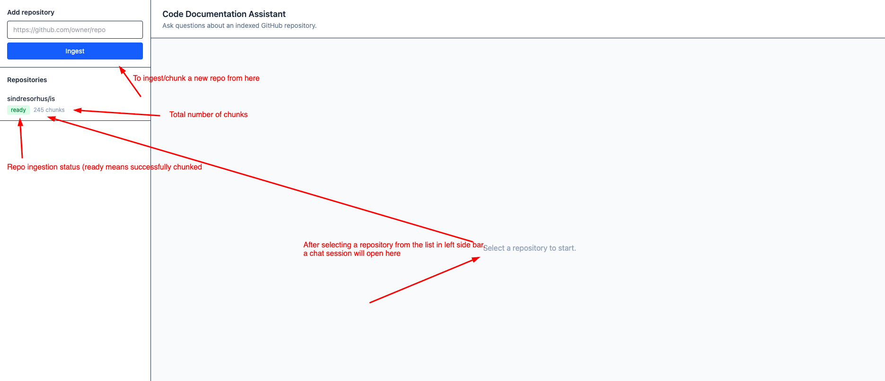
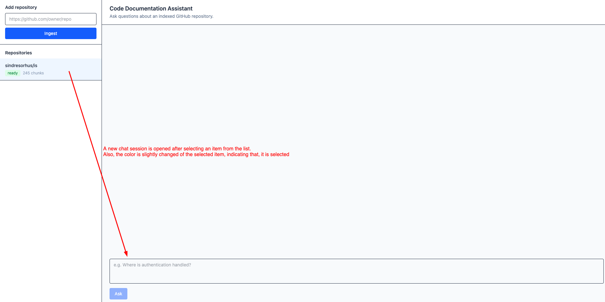
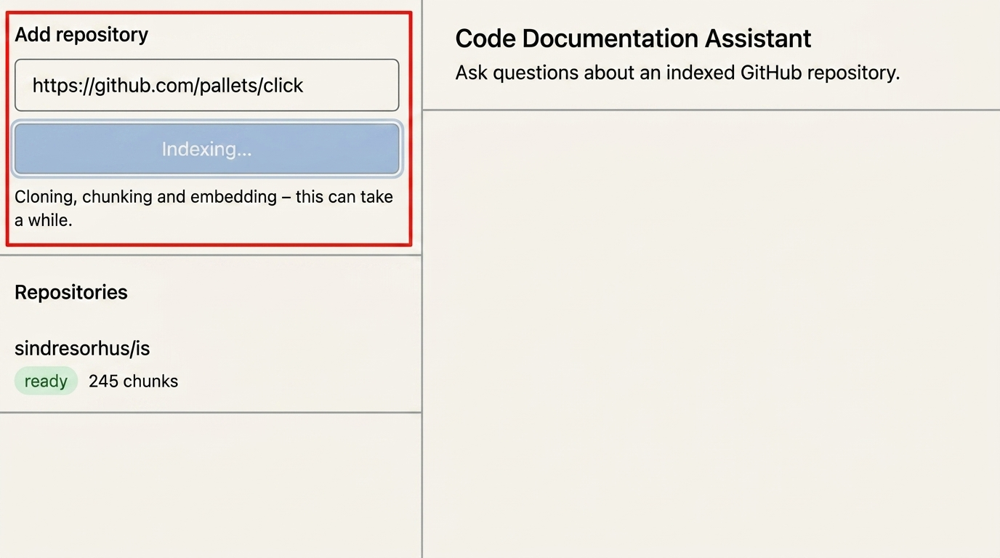

# Code Documentation Assistant

A RAG-based application that can read a public GitHub repository and answer questions about the code.

The answers are based on the actual source code and include `file:line` references so you can easily check where the information came from.

## What it does

The project has three main parts:

1. **Add a GitHub repository**
   - Clone a public GitHub repository
   - Filter the files we need
   - Split the code into meaningful chunks using Tree-sitter
   - Create embeddings locally
   - Store everything in PostgreSQL with pgvector

2. **Ask questions about the code**
   - Search the repository using both vector search and keyword search
   - Pick the most relevant code
   - Send that context to the LLM
   - Return an answer with `file:line` citations

3. **Simple React frontend**
   - Add repositories
   - Check repository ingestion
   - Ask questions about the code

## Setup
### Pre-requirements

Make sure you have:

- Docker
- Node.js 20+

The PostgreSQL database always runs inside Docker.

For the backend, you can either run everything with Docker or run the API locally using a Python virtual environment.

After cloning the repository:

### 1. Create the config files

```bash
cd backend

cp .env.example .env
cp docker-compose.yml.example docker-compose.yml
```

The default PostgreSQL username and password are:

```text
postgres / postgres # this is from .env.example; if you need, you can change in .env file
```

To use the chat feature, add your `LLM_API_KEY` and `LLM_MODEL` to the `.env` file.

See the [OpenRouter setup guide](docs/openrouter-setup.md) for details.

Embeddings run locally, so you do not need an API key for them.

### Option A — Docker only (db + api in containers)

This option runs both PostgreSQL and the API inside Docker.

If you are using a JetBrains IDE such as PyCharm, check the [troubleshooting guide](docs/troubleshooting.md) before continuing.

```bash
docker compose up -d --build # starts db + api

docker compose exec api alembic upgrade head # for DB migration
```

The API will be available at:

```text
http://localhost:8000
```
If you change `API_PORT` in the `.env` file, use that port instead.

A couple of things to keep in mind:

- The Docker image is quite large because it includes PyTorch.
- The first repository ingestion may take longer because the embedding model needs to be downloaded.

### Option B — Run API locally (venv) and database with Docker

This option is lighter and usually easier for local development.

You only need PostgreSQL from Docker, so you can remove the `api` service from `docker-compose.yml`.

Start the database:

```bash
docker compose up -d
```

Create and activate a Python virtual environment:

```bash
python -m venv .venv
source .venv/bin/activate
```

The command above is for macOS/Linux. \
On Windows, activate the virtual environment using the normal Windows virtual environment command.

Install the dependencies:

```bash
python -m pip install -r requirements.txt
```

Run the database migrations:

```bash
alembic upgrade head
```

Start the API:

```bash
uvicorn app.main:app --reload
```

Make sure `DATABASE_URL` in `.env` points to:

```text
localhost:5432
```

The username and password must also match the `POSTGRES_*` values in your `.env` file.

If they do not match, you may see an error like:

```text
password authentication failed
```

### Frontend (both options)
The frontend setup is the same for both backend options.

```bash
cd frontend
cp .env.example .env
npm install
npm run dev
```

The frontend will be available at:

```text
http://localhost:5173
```

By default, it sends `/api` requests to the backend running on port `8000`.

If you changed the backend port, also update `VITE_API_TARGET` in the frontend `.env` file.

## Documentation

| Document                                                  | What it contains                                                                                   |
|-----------------------------------------------------------|----------------------------------------------------------------------------------------------------|
| [API reference](docs/api.md)                              | API endpoints, requests, responses, errors, and curl examples                                      |
| [Postman collection](docs/postman_collection.json)        | Import into Postman to try the API                                                                 |
| [OpenRouter setup](docs/openrouter-setup.md)              | How to configure the LLM API key and model, for chat (BYOK)                                        |
| [Architecture](docs/architecture.md)                      | System components, database structure, and request flows                                           |
| [RAG / LLM decisions](docs/rag-llm-decisions.md)          | Decisions around embeddings, vector DB, retrieval, prompts, guardrails, quality, and observability |
| [Project approach](docs/project-approach.md)              | How the project was planned and scoped                                                             |
| [Engineering standards](docs/engineering-standards.md)    | Engineering practices followed in the project and skipped                                          |
| [AI usage](docs/ai-usage.md)                              | How AI tools were used during development                                                          |
| [Productionization](docs/productionization.md)            | Ideas for scaling and deploying the project                                                        |
| [What I'd do differently](docs/what-id-do-differently.md) | Improvements I would make with more time                                                           |
| [Troubleshooting](docs/troubleshooting.md)                | Common setup problems and solutions                                                                |

More detailed backend documentation, including ingestion, retrieval, chat flow, database schema, embeddings, 
and known limitations, is available inside: `backend/docs/`.

## Screenshots

**Initial page**



**Select a repository to chat with**



**Ingesting a repository**

